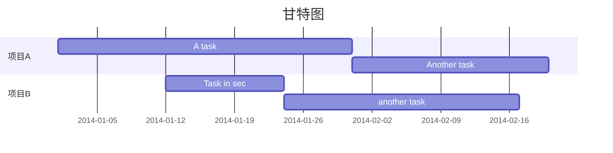

# Typora使用小技巧

## 显示模式

### 1.专注模式

快捷键 `F8` 打开专注模式，编辑器会高亮显示当前正在编辑的段落，让你更加专注于当前内容，不受视觉干扰。

### 2.打字机模式

快捷键 `F9` 打开打字机模式，当前正在编辑的段落会居中显示。

### 3.源码模式

快键键 `ctrl+/` 打开源码模式，显示纯粹的 Markdown 文本编辑。


## emoji

Markdown `:<emoji>:` 语法支持使用 Emoji 小表情，Typora 提供一个很好的提示功能，输入`:表情名称` 可以触发提示 。


## 使用Mermaid画图

输入 **```mermaid** 

https://mermaid-js.github.io/mermaid/#/



