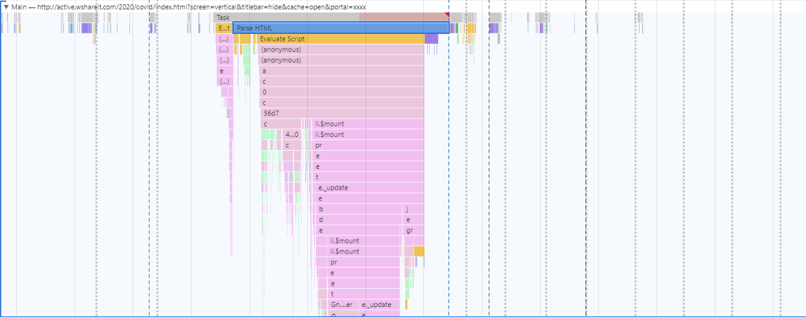

# Performance解析

## 以用户为中心的性能指标

| 体验               | 现象                                       | 指标                             |
| ------------------ | ------------------------------------------ | -------------------------------- |
| **是否发生？**     | 导航是否成功启动？服务器是否有响应？       | 首次绘制 (FP)/首次内容绘制 (FCP) |
| **是否有用？**     | 是否已渲染可以与用户互动的足够内容？       | 首次有效绘制 (FMP)/主角元素计时  |
| **是否可用？**     | 用户可以与页面交互，还是页面仍在忙于加载？ | 可交互时间 (TTI)                 |
| **是否令人愉快？** | 交互是否顺畅而自然，没有滞后和卡顿？       | 耗时较长/占用内存的任务          |

## Chrome Performance Guide

### Settings

1. Screenshots: 开启页面加载过程中每帧截图
2. Memort：展示内存消耗曲线
3. Disable javaScript samples： 禁用显示线程调用堆栈
4. Network：模拟网络环境
5. Enable advanced paint instrumentation(slow)： 记录渲染事件的细节
6. CPU: 模拟限制CPU性能

### 启动一个performance记录

**测试demo**

https://googlechrome.github.io/devtools-samples/jank/

**1. 进入无痕模式**

`ctrl + shift + n` 进入无痕模式，以确保页面在干净的浏览器环境下运行，防止浏览器中一些插件等影响

**2.模拟移动设备cpu**

DevTools/performance/cup 设置为 4 x slowdown

**3.录制**

### 分析结果解析

#### 1.概览部分 - Overview

##### **FPS**

frames per second - 每秒帧数/刷新率

FPS可以代表页面是否流畅，我们期望页面刷新率能够在30以上，最好能到达60

图中蓝色区域代表FPS监测情况，底部绿色线条越高，FPS越高，页面越流畅；顶部出现**红色块**时，表明页面出现了卡顿

##### **cpu**

图中红色框中代表cpu使用情况

不同颜色区域代表占用cpu资源的不同事件，与summary中各事件颜色对应

纵向占用面积越高，cup占用率越高

##### **NET**

网络资源使用情况

蓝色条代表正在进行网络请求

深蓝色 -- 高优先级请求

浅蓝色 -- 低优先级请求

#### 2.详情部分

> HTML 文件为蓝色，js脚本为黄色，css样式表为紫色，img/video媒体文件为绿色，其他资源为灰色

##### Main

查看主线程中发生的活动

火焰图表示主线程活动。 x轴表示随时间推移的记录。 y轴表示调用堆栈。最上面的事件导致下面的事件

##### **Network**

主线程网络资源加载的详细情况

浅色部分：TTFB(Time To First Byte):DNS解析+TCP三次握手+HTTP请求+第一字节返回的时间

深色部分：Content Download 资源下载时间

点击某个资源可在summery中查看详情

资源加载优先级：

Highest 、 High 、 Medium 、 Low 、 Lowest

默认加载顺序

浏览器首先会按照资源默认的优先级确定加载顺序：

1. html 、 css 、 font 这三种类型的资源优先级最高；
2. 然后是 preload 资源（通过 <link rel=“preload"> 标签预加载）、 script 、 xhr 请求；
3. 接着是图片、语音、视频；
4. 最低的是prefetch预读取的资源。

https://juejin.im/post/5a4ed917f265da3e317df515

##### Frames

单击概览图表部分，查看每帧的加载时长、截图等情况

##### Timings

**DCL** -- DOMContentLoaded Event

当 HTML 文档被完全加载和解析完成之后，DOMContentLoaded 事件被触发，无需等待样式表、图像和子框架的完成加载.

**FP** -- First Paint (首次绘制)

> FP is the time between navigation and when the browser renders the first pixels to the screen, rendering anything that is visually different from what was on the screen prior to navigation. It answers the question "Is it happening?"

FP标记浏览器渲染任何在视觉上不同于白板内容的事件点 （骨架屏）

**FCP** -- First Contentful Paint （首次内容绘制）

> FCP is when the browser renders the first bit of content from the DOM, providing the first feedback to the user that the page is actually loading. The question "Is it happening?" is "yes" when the first contentful paint completes.
>
> The First Contentful Paint time stamp is when the browser first rendered any text, image (including background images), non-white canvas or SVG. This excludes any content of iframes, but includes text with pending webfonts. This is the first time users could start consuming page content.

浏览器首次渲染任何文本，图像（包括背景图像），非白色画布或SVG时的时间戳。这不包括iframe的任何内容，但包括带有待定Web字体的文本。这是用户第一次开始使用页面内容。

**FMP** -- First Meaningful Paint (首次有效绘制)

> FMP is the paint after which the biggest above-the-fold layout change has happened and web fonts have loaded. It is when the answer to "Is it useful?" becomes "yes", upon first meaningful paint completion.

页面的首要内容（primary content）出现在屏幕上的时间，对于不同的站点，首要内容是不同的，例如：

- 对于博客文章：大标题+首屏文字是首要内容
- 对于百度或者google的搜索结果页：首屏的结果卡片就是首要内容
- 而对于淘宝等购物网站来说：图也会变得很重要

**LCP** -- Largest Contentful Paint

用于监控网页可视区内“绘制面积”最大的元素开始呈现在屏幕上的时间点

**L** -- Onload Event

当依赖的资源, 全部加载完毕之后才会触发

**TTI**

##### Interactions

用户交互相关

##### Experience

#### 3.总结

蓝色(Loading)：网络通信和HTML解析
黄色(Scripting)：JavaScript执行
紫色(Rendering)：样式计算和布局，即重排
绿色(Painting)：重绘
灰色(other)：其它事件花费的时间
白色(Idle)：空闲时间

**Call Tree Tab**

Use the **Call Tree** tab to view which [root activities](https://developers.google.com/web/tools/chrome-devtools/evaluate-performance/reference#root-activities) cause the most work.

消耗性能统计

**Bottom-Up Tab**

Use the **Bottom-Up** tab to view which activities directly took up the most time in aggregate.

花费时长统计

**Event Log Tab**

Use the **Event Log** tab to view activities in the order in which they occurred during the recording.

执行事件统计